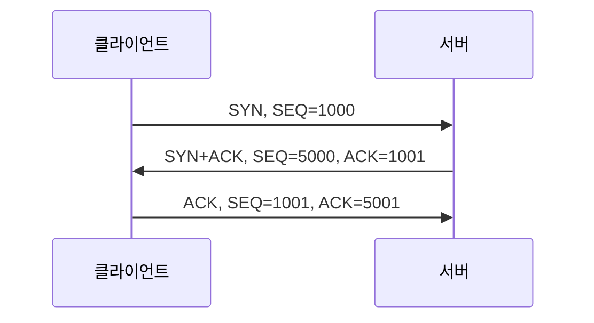

# 02. TCP·UDP와 연결 관리

> 목표: 신뢰성이 필요한 이유, 연결의 식별, 손실 복구와 전송량 제한을 하나의 흐름으로 설명한다.

## 1. 서비스의 차이

| 항목 | TCP | UDP |
|---|---|---|
| 애플리케이션에 보이는 데이터 | 순서 있는 바이트 스트림 | 개별 데이터그램 |
| 메시지 경계 | 보존하지 않음 | 보존 |
| 연결 설정 | 기본적으로 핸드셰이크 수행 | UDP 자체 핸드셰이크 없음 |
| 손실 복구·순서 보장 | 프로토콜에 포함 | 프로토콜 자체에는 없음 |
| 흐름·혼잡 제어 | 포함 | 상위 프로토콜/앱에서 필요에 따라 구현 |
| 기본 헤더 | 최소 20바이트 | 8바이트 |

TCP는 복구 가능한 손실에 대응하는 것이지 영구적인 단절에도 전달을 보장하는 것은 아닙니다. 또한 TCP ACK는 상대 TCP가 데이터를 받았다는 의미이며, 서버가 주문을 저장하거나 결제를 완료했다는 의미는 아닙니다.

UDP가 메시지 경계를 보존해도 도착·순서·중복 방지를 보장하지는 않습니다. 실시간 음성처럼 늦은 데이터의 가치가 낮은 상황에서 유리할 수 있지만, “UDP가 항상 빠르다”는 결론은 요구사항과 네트워크 조건을 생략한 것입니다. QUIC은 UDP 위에 신뢰성 있는 스트림·흐름 제어·혼잡 제어를 구현하는 예입니다. [RFC 9000](https://www.rfc-editor.org/rfc/rfc9000.html)

## 2. 포트와 소켓

`192.168.10.20:52000 → 203.0.113.10:443`에서 클라이언트에도 응답을 받을 포트가 필요합니다. TCP 연결은 양쪽 IP와 포트의 조합으로 식별하며, 전송 프로토콜까지 포함하면 흔히 5-tuple이라고 합니다.

서버는 443번 포트 하나로 여러 클라이언트를 받을 수 있습니다. 상대 IP나 포트가 다르면 연결 식별 조합이 다르기 때문입니다. 프로그래밍의 소켓은 통신을 위한 OS 객체/API이고, 단순히 숫자 `IP:포트`만을 뜻하지 않습니다. 서버의 리스닝 소켓과 accept 이후 연결 소켓도 구분합니다.

TCP와 UDP는 별도의 포트 공간을 사용합니다. UDP 소켓에 `connect()`를 호출할 수 있지만 그것이 TCP식 연결 협상을 만든다는 뜻은 아닙니다.

## 3. 바이트 스트림과 메시지 경계

송신자가 `HELLO`, `WORLD`를 두 번 write했다고 해서 수신자도 정확히 두 번 read하는 것은 아닙니다. `HELLOWO`와 `RLD`처럼 나뉘어 읽을 수 있으므로 앱이 길이 필드·구분자·고정 길이 등으로 메시지를 해석해야 합니다.

TCP 순서 번호는 바이트 위치를 나타냅니다. `SEQ=1001`, 데이터 길이 100바이트를 연속 수신했다면 다음 누적 ACK는 `1101`입니다. SYN과 FIN도 각각 순서 번호 1개를 소비하며, 데이터 없는 순수 ACK는 소비하지 않습니다. [RFC 9293](https://www.rfc-editor.org/rfc/rfc9293.html)

## 4. 연결 수립



양방향 스트림의 초기 순서 번호를 교환하고 상대가 이를 받았는지 확인합니다. 마지막 ACK가 없으면 서버는 자신의 SYN이 수신되었는지 확인하지 못합니다. 단순한 “연결해도 될까요?” 대화로만 외우지 말고 두 방향의 순서 번호를 함께 설명합니다.

## 5. 연결 종료와 상태

일반적인 능동 종료를 가정합니다.

| 단계 | 능동 종료 측 | 수동 종료 측 |
|---|---|---|
| FIN 전송 | FIN-WAIT-1 | FIN 수신 후 CLOSE-WAIT |
| FIN의 ACK 수신 | FIN-WAIT-2 | 앱이 자신의 송신 종료 준비 |
| 상대 FIN 전송/수신 | ACK를 보내고 TIME-WAIT | LAST-ACK |
| 마지막 ACK 수신 | 일정 기간 후 CLOSED | CLOSED |

FIN은 한 방향의 송신 종료입니다. 반대 방향에 데이터가 남아 있을 수 있어 종료가 독립적으로 진행됩니다. ACK와 FIN이 합쳐질 수 있으므로 실제 패킷 수가 반드시 4개는 아닙니다.

TIME-WAIT은 마지막 ACK가 유실되어 FIN이 다시 올 때 응답하고, 오래된 세그먼트가 새 연결에 혼입되는 것을 줄이기 위한 상태입니다. CLOSE-WAIT가 장기간 쌓인다면 상대 종료 이후 애플리케이션이 소켓을 제대로 닫는지 조사합니다. 상태가 존재한다는 사실만으로 장애라고 단정하지 않습니다.

## 6. 손실 복구

- **누적 ACK**: 빈틈 없이 받은 마지막 바이트 다음 위치를 알립니다.
- **RTO**: 시간 내 ACK를 못 받았을 때 재전송합니다. RTT와 그 변동을 반영합니다.
- **Fast retransmit**: 전통적인 모델에서는 중복 ACK 3개를 손실의 신호로 사용합니다.
- **SACK**: 누적 ACK 이후에 따로 받은 구간을 알려 불필요한 재전송을 줄입니다.
- **체크섬**: 전송 중 손상을 검출합니다. 암호학적 위변조 방지는 아닙니다.

실습: 100바이트씩 보낸 `1000~1099`, `1100~1199`, `1200~1299` 중 두 번째 구간이 유실되면 누적 ACK는 `1100`에 머뭅니다. 마지막 구간을 보관한 상태에서 빈 구간이 재전송되면 ACK는 `1300`으로 진행할 수 있습니다. 같은 숫자의 ACK가 세 번 보였다는 사실과 **기존 ACK 이후 중복 ACK 세 개**는 구분해야 합니다.

## 7. 흐름 제어와 혼잡 제어

| 구분 | 보호 대상 | 주요 값 | 값의 관리 |
|---|---|---|---|
| 흐름 제어 | 수신자의 처리 능력·버퍼 | rwnd | 수신자가 광고 |
| 혼잡 제어 | 네트워크 경로 | cwnd | 송신자가 조절 |

단순화한 모델에서 미확인 데이터의 상한은 `min(rwnd, cwnd)`입니다. 이미 전송한 미확인 데이터가 있으므로 이 값을 곧바로 “새로 보낼 수 있는 양”으로 해석하지 않습니다.

```text
rwnd = 64 KiB, cwnd = 16 KiB, 미확인 데이터 = 12 KiB
새로 보낼 수 있는 여유 ≈ 16 - 12 = 4 KiB
```

수신 앱이 읽지 않아 rwnd가 0이면 네트워크가 빨라도 송신이 제한됩니다. 반대로 수신 버퍼가 커도 경로가 혼잡하면 cwnd가 제한합니다.

Reno 계열의 입문 모델에서 slow start는 ACK를 받으며 윈도를 빠르게 늘리고, 임계값 이후 congestion avoidance는 더 완만하게 늘립니다. 손실 시 전송량을 줄이며 타임아웃과 중복 ACK에 대한 대응은 다릅니다. 이 모델을 모든 현대 TCP 구현의 정확한 증가 곡선으로 일반화하지 않습니다. [RFC 5681](https://www.rfc-editor.org/rfc/rfc5681.html)

## 8. MTU와 MSS

MTU는 링크에서 전달할 수 있는 IP 패킷 크기 한도를 설명할 때 사용하고, MSS는 TCP 데이터 크기와 관련됩니다. MTU 1500, IPv4 기본 헤더 20, TCP 기본 헤더 20을 가정하면 데이터는 1460바이트입니다. 옵션·터널·IPv6 등 조건이 바뀌면 수치도 달라집니다.

## 9. 스스로 설명하기

- [ ] TCP ACK와 비즈니스 처리 완료의 차이를 설명한다.
- [ ] 서버 포트 하나에 연결 여러 개가 가능한 이유를 설명한다.
- [ ] 느린 수신자와 혼잡한 경로를 구분한다.
- [ ] SEQ·ACK를 바이트 단위로 계산하고 FIN의 의미를 말한다.

작성 범위와 공개 참고문서: [출처 기록](../../sources/README.md). 비공개 원본 주소는 공개본에서 제외했습니다.
