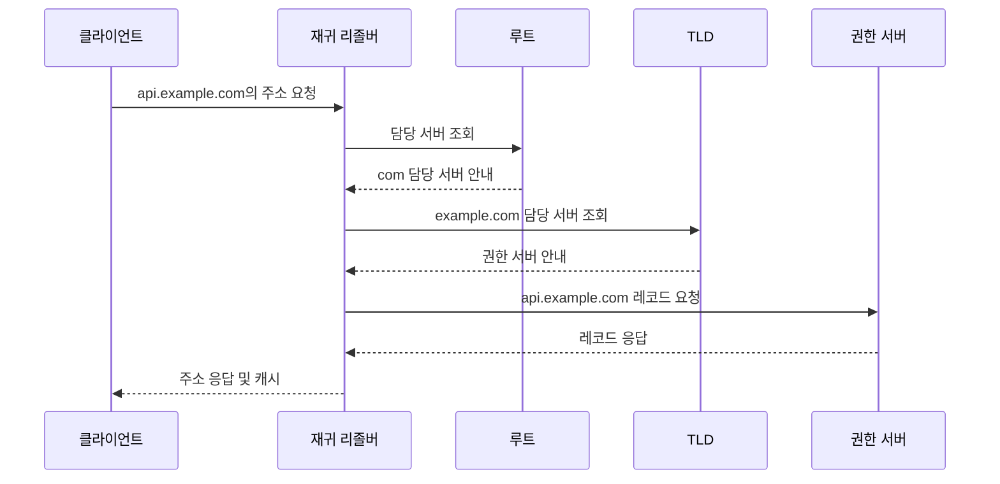

# 03. DNS·HTTP·TLS·상태 관리

> 목표: 서버를 찾는 과정, 안전하게 통신하는 과정, 로그인 상태를 유지하는 과정을 구분한다.

## 1. DNS: 이름에 대한 레코드를 찾는다

DNS는 도메인 이름을 IP로 바꾸는 기능으로 자주 소개되지만 A·AAAA 외에도 CNAME·MX·TXT·NS 등 여러 레코드를 다룹니다. 도메인과 IP는 일대일 관계가 아닙니다. 하나의 이름에 여러 주소가 있거나 여러 이름이 하나의 주소를 사용할 수 있습니다.

캐시가 없는 일반적인 재귀 리졸버 조회를 단순화하면 다음과 같습니다.



클라이언트는 리졸버에 최종 답을 요청하고, 리졸버는 여러 서버를 순차 조회할 수 있습니다. 실제로는 브라우저·OS·리졸버의 캐시나 위임 정보 때문에 일부 단계가 생략됩니다. CNAME을 따라 추가 질의가 생길 수도 있습니다. TTL은 캐시 사용 시간을 제한하므로 DNS 변경이 모든 사용자에게 즉시 반영되지는 않습니다.

## 2. DNS는 UDP인가 TCP인가?

전통적인 DNS는 UDP와 TCP 모두 53번 포트를 사용합니다. 작은 질의·응답은 UDP로 처리하는 경우가 많고, 잘린 응답의 TC 비트를 받으면 TCP로 다시 질의할 수 있습니다. TCP는 큰 응답의 예외 처리에만 한정되지 않으며 DNS 구현에서 중요한 기본 기능입니다. [RFC 7766](https://www.rfc-editor.org/rfc/rfc7766.html)

EDNS는 UDP 응답 크기 등 확장 정보를 전달합니다. 따라서 **512바이트 초과면 무조건 TCP**라고 말하면 부정확합니다. 광고한 수신 크기와 경로 MTU를 고려해야 하며, 큰 UDP 데이터그램의 IP 단편화는 손실에 취약할 수 있습니다. [RFC 6891](https://www.rfc-editor.org/rfc/rfc6891.html)

UDP 데이터가 손실되었을 때 DNS의 재시도는 상위 계층 동작입니다. UDP 자체가 자동으로 복구한다고 설명하지 않습니다.

| 기술 | 핵심 목적 | 구분 |
|---|---|---|
| DNSSEC | DNS 데이터의 출처·무결성 검증 | 질의 내용을 숨기는 기능과 다름 |
| DoT | DNS를 TLS로 보호 | 일반적으로 TCP 853 |
| DoH | DNS를 HTTPS로 전달 | 일반적으로 443, HTTP 버전에 따라 전송 방식 다름 |

## 3. HTTP의 의미와 연결은 별개다

HTTP는 메서드·대상 리소스·헤더·상태 코드 등 요청과 응답의 의미를 정의합니다. 무상태라는 말은 이전 요청의 대화 상태에 의존하지 않고 요청을 해석하는 모델을 말합니다. 서비스가 로그인 세션을 저장할 수 없다는 뜻은 아닙니다.

HTTP/1.1은 기본적으로 지속 연결을 사용합니다. 따라서 “요청마다 반드시 TCP를 끊는다”는 설명은 적절하지 않습니다. HTTP/2는 여러 스트림을 한 연결에 다중화하고, HTTP/3는 QUIC을 사용합니다. HTTP의 무상태성과 전송 연결의 재사용은 함께 성립합니다. [HTTP/1.1 규격](https://www.rfc-editor.org/rfc/rfc9112.html), [HTTP/3 규격](https://www.rfc-editor.org/rfc/rfc9114.html)

HTTP/1.1 요청 예시:

```http
GET /products/42 HTTP/1.1
Host: shop.example.com
Accept: application/json

```

HTTP/2·3에서는 위 텍스트 시작줄 형식을 그대로 전송한다고 설명하지 않습니다. 같은 IP에서 여러 사이트를 운영할 때 HTTP의 Host 또는 해당 버전의 authority 정보가 대상 사이트 식별에 쓰입니다. HTTPS 연결 설정에는 SNI도 관련됩니다.

## 4. 메서드와 상태 코드

| 개념 | 의미 | 예시 |
|---|---|---|
| 안전성 | 요청한 의미가 본질적으로 읽기 중심 | GET, HEAD |
| 멱등성 | 같은 요청을 반복한 의도된 서버 효과가 한 번과 같음 | PUT, DELETE |
| 비멱등 동작 | 반복 시 추가 효과가 생길 수 있음 | 일반적인 주문 POST |

DELETE를 다시 보내 404를 받아도 리소스가 삭제된 최종 효과는 같을 수 있습니다. 멱등성은 응답 코드나 로그가 매번 같다는 뜻이 아닙니다. PUT은 대상 상태의 생성·교체 의미이며, PATCH는 변경 연산에 따라 멱등성이 달라질 수 있습니다. [RFC 9110](https://www.rfc-editor.org/rfc/rfc9110.html)

- `200`: 성공, `201`: 리소스 생성, `204`: 본문 없는 성공
- `301/302`: 리다이렉션, `304`: 캐시된 표현 재사용에 관한 응답
- `400`: 잘못된 요청, `401`: 인증 관련, `403`: 요청 거부, `404`: 찾을 수 없음
- `500`: 서버 내부 오류, `502`: 게이트웨이가 잘못된 upstream 응답 수신, `503`: 일시적 서비스 불가, `504`: 게이트웨이의 upstream 대기 시간 초과

## 5. HTTPS와 TLS

HTTPS는 HTTP 통신을 TLS로 보호합니다. 핵심은 기밀성·무결성·상대 인증입니다. 서버 인증은 일반적인 웹 접속에서 수행되며 클라이언트 인증서까지 쓰는 구성은 별도입니다.

TLS 1.3의 일반적인 인증서 기반 핸드셰이크는 알고리즘과 키 교환 정보를 협의하고 서버 인증서를 검증한 뒤 공유 비밀에서 트래픽 키를 유도합니다. 실제 데이터 보호에는 대칭키 기반 AEAD가 사용됩니다. **TLS 1.3에는 기존 RSA 키 전달 방식이 없습니다.** RSA 인증서나 서명과 RSA 키 교환을 혼동하지 않습니다. [RFC 8446](https://www.rfc-editor.org/rfc/rfc8446.html)

인증서 검증에서는 신뢰 사슬, 유효기간, 요청 호스트명과의 일치 등을 봅니다. HTTPS가 사이트의 사업 내용이나 서버 저장 데이터까지 모두 안전하다고 보증하지는 않습니다. TLS가 어디에서 종료되는지도 확인해야 합니다. 프록시에서 종료된다면 프록시와 앱 서버 사이 보호는 별도 설계입니다.

HTTP/1.1·2의 일반적인 HTTPS 경로는 TCP 이후 TLS입니다. HTTP/3는 QUIC에 TLS 1.3 핸드셰이크가 통합되어 있으므로 먼저 TCP 3-way handshake를 수행한다고 말하지 않습니다.

## 6. 쿠키와 세션

쿠키는 브라우저에 저장되고 조건에 맞는 요청에 자동 첨부되는 작은 데이터입니다. 서버 세션은 서버 측에서 사용자 상태를 관리하는 방식입니다. 세션 ID를 쿠키로 전달하는 조합이 흔하므로 둘은 대체재로만 볼 수 없습니다.

```text
로그인 성공
  → 서버: 세션 생성
  → 응답: Set-Cookie로 불투명한 세션 ID 전달
  → 브라우저: 조건에 맞는 다음 요청에 Cookie 전송
  → 서버: 세션 ID로 사용자 상태 조회
```

| 쿠키 속성 | 역할 | 보장하지 않는 것 |
|---|---|---|
| HttpOnly | JavaScript의 쿠키 직접 읽기 제한 | 모든 XSS 피해 방지 |
| Secure | 보안 연결에서 쿠키 전송 | 값 자체의 암호화 저장 |
| SameSite | 사이트 간 요청에서 쿠키 첨부 제어 | 모든 CSRF 시나리오의 완전 차단 |
| Domain·Path | 전송 범위 조절 | 강한 권한 분리 경계 |

실제 전송 여부는 도메인·경로·만료·보안 속성과 브라우저 정책에 따라 달라집니다. “모든 요청에 모든 쿠키가 전송된다”는 설명은 틀립니다. [MDN 쿠키 안내](https://developer.mozilla.org/en-US/docs/Web/HTTP/Guides/Cookies)

세션 ID를 탈취하면 서버에 상태를 보관해도 세션 하이재킹이 가능할 수 있습니다. 서버가 여러 대라면 세션 공유 저장소, 세션 복제, 고정 라우팅 등을 검토합니다. 각 방식은 일관성·장애 대응·운영 비용이 다릅니다.

## 7. 확인 문제

1. DNS 캐시가 있으면 TCP 연결도 이미 존재하는가? → 별개입니다.
2. HTTP가 무상태이면 연결 재사용이 불가능한가? → 가능합니다.
3. Secure와 HttpOnly 중 JavaScript의 직접 읽기를 제한하는 것은? → HttpOnly입니다.
4. TLS 1.3에서는 RSA 인증서를 쓸 수 없나? → 키 교환 제거와 인증서 서명 알고리즘은 별개입니다.

작성 범위와 공개 참고문서: [출처 기록](../../sources/README.md). 비공개 원본 주소는 공개본에서 제외했습니다.
